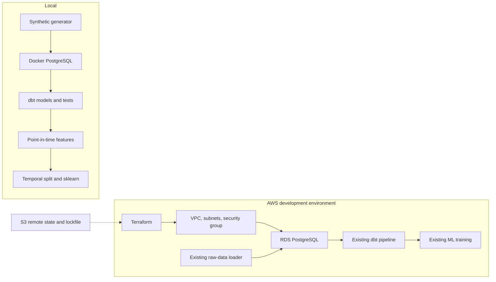

# E-commerce ML Data Platform

[](https://github.com/Eklavya20/ecommerce-ml-data-platform/actions/workflows/ci.yml)

End-to-end ML data engineering project using PostgreSQL, dbt, scikit-learn, Docker, Terraform, and AWS RDS. The platform transforms transactional data into tested analytical models and point-in-time-correct ML features, with the same pipeline validated locally and on AWS.

## Verified implementation

- dbt build: **194/194 passed**
- **19** dbt models
- **173** data tests
- **2** dbt unit tests
- Point-in-time training dataset: **1,349 customer-cutoff rows**
- Temporal train/validation/test split
- Local Docker PostgreSQL workflow validated
- Terraform-managed AWS RDS deployment validated
- Same ML results reproduced locally and against AWS RDS

> Model metrics use deterministic synthetic data and demonstrate pipeline behaviour only. They do not represent real-world predictive performance or business value.

## Overview

The repository models synthetic e-commerce customers, products, orders, order items, payments, and returns. It demonstrates the boundary between infrastructure, analytics transformations, and model training:

- Terraform provisions optional AWS development infrastructure.
- Python generates deterministic raw source data.
- dbt owns transformations, tests, documentation, historical features, and labels.
- Python/scikit-learn owns temporal splitting, train-only preprocessing, training, and evaluation.

The same `DB_*` environment variables switch the pipeline between local Docker PostgreSQL and AWS RDS; there is no duplicated dbt project or feature logic.

## Architecture



The transformation path is:

```text
raw PostgreSQL
  -> staging views
  -> intermediate business logic
  -> core dimensions and facts
  -> reporting marts
  -> historical cutoffs
  -> point-in-time customer features
  -> labelled training dataset
  -> temporal model evaluation
```

See [architecture details](docs/architecture.md) and [metric definitions](docs/metric_definitions.md).

## What the project demonstrates

- Layered dbt modelling with `source()` and `ref()` lineage
- Source freshness, schema tests, a reusable generic test, singular business tests, and unit tests
- Fan-out-safe return aggregation before order-item financial joins
- Incremental order facts with a late-arriving-data watermark and lookback
- Point-in-time-correct ML features and fully observable 30-day labels
- Chronological train/validation/test splitting and train-only preprocessing
- DummyClassifier and LogisticRegression evaluation with reproducible JSON metrics
- Docker-based local execution and environment-independent database configuration
- Terraform remote state, AWS networking, least-exposure development access, and RDS PostgreSQL
- GitHub Actions regression testing without AWS credentials or cloud deployment

## Local workflow

Prerequisites: Python 3.11, Docker Compose, and a shell.

```bash
cp .env.example .env
cp dbt/profiles.yml.example dbt/profiles.yml

python -m venv .venv
source .venv/bin/activate        # Windows PowerShell: .venv\Scripts\Activate.ps1
python -m pip install --upgrade pip
python -m pip install -r requirements.txt

docker compose up -d
python -m data_generator.generate_and_load --seed 42 --scale 20 --batch baseline
dbt debug --project-dir dbt --profiles-dir dbt
dbt source freshness --project-dir dbt --profiles-dir dbt
dbt build --full-refresh --project-dir dbt --profiles-dir dbt
python -m ml.train
```

The example local configuration uses `DB_HOST=localhost`, `DB_PORT=5432`, `DB_NAME=ecommerce`, and development-only credentials from `.env.example`.

## dbt and data modelling

The dbt project contains six one-to-one staging models, four intermediate models, two dimensions, two facts, two reporting marts, and three ML models. `int_returns_by_order_item` first reduces multiple return events to one row per order item, preventing financial fan-out.

`fct_orders` is incremental with `order_id` as its unique key, `delete+insert` updates, a `source_updated_at` watermark, and a three-day lookback. The deterministic delta loader exercises new orders, payment retries, late successful payments, and late partial returns.

```bash
python -m data_generator.generate_and_load --seed 42 --scale 1 --batch delta
dbt build --project-dir dbt --profiles-dir dbt
```

Generate browsable documentation and lineage with:

```bash
dbt docs generate --project-dir dbt --profiles-dir dbt
dbt docs serve --project-dir dbt --profiles-dir dbt
```

## ML feature pipeline

The target `repeat_purchase_30d` is 1 when a customer places a qualifying paid/completed order in `(prediction_cutoff_date, prediction_cutoff_date + 30 days]`.

Monthly cutoffs require at least 90 days of history and a complete 30-day future observation window. Orders, payments, returns, and their update timestamps are bounded at the cutoff; only label construction can inspect the next 30 days. Earlier cutoffs train the models, the penultimate cutoff is validation, and the latest cutoff is test.

For seed 42 at scale 20, the dataset has 1,349 rows, 183 customers, nine cutoffs, and 118 positive labels. Test ROC-AUC is 0.500 for DummyClassifier and 0.935 for LogisticRegression. Full evaluation output is written to the ignored `ml/artifacts/metrics.json`.

## Terraform and AWS deployment

Terraform owns infrastructure only; it never creates raw tables or dbt models. The validated AWS path was:

```text
Terraform -> VPC/networking -> RDS PostgreSQL -> existing raw-data loader -> dbt build -> ML training
```

The AWS region is configurable through `aws_region` and the backend initialization arguments. `eu-central-1` is only an example default, not a guarantee for every account. AWS Organizations and project policies may restrict permitted deployment regions. This repository's real AWS validation used **eu-north-1**, the region allowed by the test project, and the development RDS environment was destroyed afterward.

Bootstrap versioned, encrypted, public-blocked S3 state first:

```bash
cd infra/terraform/bootstrap
cp terraform.tfvars.example terraform.tfvars
# Set a globally unique bucket name and an AWS region allowed by your account.
terraform init
terraform validate
terraform plan -out=bootstrap.tfplan
terraform apply bootstrap.tfplan
```

Then deploy the development environment using the same selected region and your current public IPv4 `/32`:

```bash
cd ../environments/dev
cp terraform.tfvars.example terraform.tfvars
# Set aws_region and allowed_cidr; provide the password outside Git.
export TF_VAR_db_password="YOUR_STRONG_RDS_PASSWORD"
export AWS_REGION="YOUR_AWS_REGION"

terraform init \
  -backend-config="bucket=YOUR_STATE_BUCKET" \
  -backend-config="region=$AWS_REGION"
terraform validate
terraform plan -out=dev.tfplan
terraform apply dev.tfplan
```

Detailed bootstrap, database initialization, pipeline, and cleanup commands are in the [bootstrap guide](infra/terraform/bootstrap/README.md) and [development guide](infra/terraform/environments/dev/README.md).

## Testing and validation

`dbt build` executes models, 173 data tests, and exactly two unit tests in dependency order. Leakage-focused tests reject future feature events and incomplete label windows. The ML command is run twice during CI and its artifact hashes are compared for determinism.

CI uses an isolated PostgreSQL service container and the scale-20 deterministic fixture because scale 1 is intentionally too small to produce the required historical ML cutoffs. Terraform CI runs formatting and configuration validation only: it uses no AWS credentials and never plans, applies, or destroys cloud resources.

## Reproduction instructions

Run the complete local regression from the repository root:

```bash
docker compose up -d
python -m data_generator.generate_and_load --seed 42 --scale 20 --batch baseline
dbt source freshness --project-dir dbt --profiles-dir dbt
dbt build --full-refresh --project-dir dbt --profiles-dir dbt
python -m ml.train
docker compose down
```

Validate Terraform without contacting an AWS backend:

```bash
terraform fmt -recursive -check infra/terraform
terraform -chdir=infra/terraform/bootstrap init -backend=false -reconfigure -input=false
terraform -chdir=infra/terraform/bootstrap validate
terraform -chdir=infra/terraform/environments/dev init -backend=false -reconfigure -input=false
terraform -chdir=infra/terraform/environments/dev validate
```

## Security and cost limitations

- `.env`, dbt profiles, Terraform state, real `.tfvars`, plans, local runtimes, and generated artifacts are ignored.
- AWS credentials come from the standard credential chain and are never Terraform inputs.
- Terraform state contains the sensitive RDS password, so the S3 bucket and lockfile require restricted IAM access.
- Development PostgreSQL ingress accepts exactly one configurable public IPv4 `/32`; `0.0.0.0/0` is rejected.
- Public RDS access is a temporary workstation-driven demo design. Production should use private subnets, in-VPC workloads, managed secret rotation, stronger recovery settings, and appropriate HA.
- RDS runtime/storage, S3 storage/requests, and data transfer may incur charges. No free-tier claim is made.

Destroy the development database immediately after testing:

```bash
terraform -chdir=infra/terraform/environments/dev destroy
```

No Airflow, Kafka, Kubernetes, ECS, FastAPI, SageMaker, MLflow, or production deployment stack is included.
