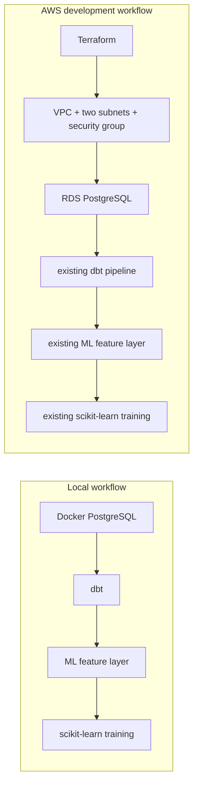

# E-commerce Analytics Data Platform

An analytics and ML data engineering project that transforms deterministic synthetic e-commerce transactions into tested PostgreSQL dimensions, facts, reporting marts, and point-in-time-correct training data with dbt. The same pipeline runs against local Docker PostgreSQL or a small Terraform-managed AWS RDS environment.

Phase 1 demonstrates PostgreSQL, dbt modelling, source freshness, data quality, documentation, late-arriving updates, and idempotent incremental processing. Phase 2 adds historical feature snapshots, leakage-safe labels, temporal model evaluation, and a reproducible scikit-learn workflow. Phase 3 adds an intentionally small AWS infrastructure layer with remote Terraform state, isolated networking, and RDS PostgreSQL. All people, products, orders, and payments are synthetic.

## Business problem

Transactional tables are suitable for operating a shop but are awkward and risky for analytics. Payment retries can overstate collections, and multiple partial returns can multiply order-item rows if they are joined before aggregation. This project produces reliable answers to questions such as:

- How much gross and post-refund revenue did each channel produce per day?
- Which customers order most frequently and what is their current return behaviour?
- Did paid orders collect the correct pre-refund sales amount?
- Can late payments and returns update existing order facts without duplicates?

## Architecture

```text
Synthetic Python source generator
              |
              v
PostgreSQL raw (6 constrained source tables)
              |
              v
dbt staging views (one-to-one)
              |
              v
dbt intermediate views
              |
              v
core dimensions + facts
              |
              v
daily sales + customer 360 marts
              |
              v
historical cutoffs -> point-in-time features -> labelled training dataset
              |
              v
temporal split -> preprocessing -> classifiers -> evaluation artifact
```

The critical returns path aggregates events before joining them to order items:

```text
stg_returns -> int_returns_by_order_item -> int_order_item_financials
```

See [docs/architecture.md](docs/architecture.md) and [docs/metric_definitions.md](docs/metric_definitions.md) for design details and business definitions.



## Repository structure

```text
data_generator/       deterministic baseline and delta loader
dbt/models/staging/   one-to-one source models
dbt/models/intermediate/
                      payment, return, item, and order transformations
dbt/models/marts/core/
                      dimensions and facts
dbt/models/marts/reporting/
                      daily sales and customer 360
dbt/models/marts/ml/  cutoffs, feature snapshots, and training data
dbt/tests/            generic, business, and leakage tests
ml/                   PostgreSQL loader, temporal split, training, evaluation
docker/init/          raw PostgreSQL DDL
docs/                 architecture and metric definitions
infra/terraform/bootstrap/
                      encrypted and versioned S3 state bucket
infra/terraform/environments/dev/
                      VPC, network controls, and RDS PostgreSQL
```

## Prerequisites

- Python 3.11
- Docker with Docker Compose
- Terraform 1.16.x for AWS infrastructure
- AWS credentials configured through the standard AWS credential chain for AWS use
- A shell capable of setting environment variables

## Local setup

```bash
cp .env.example .env
cp dbt/profiles.yml.example dbt/profiles.yml

python -m venv .venv
source .venv/bin/activate        # Windows PowerShell: .venv\Scripts\Activate.ps1
python -m pip install --upgrade pip
python -m pip install -r requirements.txt

docker compose up -d
docker compose ps
```

The example credentials are local development defaults only. Both `.env` and `dbt/profiles.yml` are ignored by Git.

All database clients use the same environment contract:

```text
DB_HOST, DB_PORT, DB_NAME, DB_USER, DB_PASSWORD, DBT_SCHEMA
```

For local Docker, `DB_HOST=localhost`. For AWS, set `DB_HOST` to the non-secret `rds_endpoint` Terraform output. There is one dbt project and one Python workflow; no environment-specific transformation logic is duplicated.

## Baseline build

Run commands from the repository root:

```bash
python -m data_generator.generate_and_load --seed 42 --scale 1 --batch baseline

dbt debug --project-dir dbt --profiles-dir dbt
dbt source freshness --project-dir dbt --profiles-dir dbt
dbt build --project-dir dbt --profiles-dir dbt
```

The default scale creates a compact dataset suitable for local iteration. Increasing `--scale` multiplies its customer, product, and order counts while preserving deterministic behaviour for a seed.

## Point-in-time ML workflow

The prediction task is `repeat_purchase_30d`: for a customer at a `prediction_cutoff_date`, predict whether at least one paid or completed order with a successful payment occurs in `(cutoff, cutoff + 30 days]`.

Generate the larger deterministic fixture and run the complete workflow:

```bash
python -m data_generator.generate_and_load --seed 42 --scale 20 --batch baseline
dbt source freshness --project-dir dbt --profiles-dir dbt
dbt build --full-refresh --project-dir dbt --profiles-dir dbt
python -m ml.train
dbt build --project-dir dbt --profiles-dir dbt
```

Monthly cutoffs begin only after 90 days of history and are excluded unless the source data contains the entire following 30-day label window. The latest cutoff is the test period, the preceding cutoff is validation, and all earlier cutoffs are training data. This ordering prevents a future period from training a model evaluated on an earlier one.

Feature queries admit only orders and payment attempts dated and last updated on or before the cutoff. Returns are re-aggregated for every cutoff using only events returned and last updated by that date; current, late-arriving refund totals are never reused for a historical snapshot. The target is the only calculation allowed to inspect the following 30 days. Leakage-focused dbt tests enforce the event boundaries and complete observation windows.

Python reads the dbt-produced table from PostgreSQL; it does not duplicate feature logic. Both classifiers use a scikit-learn pipeline whose median imputer and standard scaler are fit on training rows only. The command writes `ml/artifacts/metrics.json`, which is intentionally ignored by Git.

For the seed-42, scale-20 fixture, the training dataset contains 1,349 rows, 183 customers, nine cutoffs, and 118 positive labels (8.75%). The split is May-November 2025 for training, December 2025 for validation, and January 2026 for testing. At a transparent 0.5 threshold, the test results are:

| Model | ROC-AUC | PR-AUC | Precision | Recall | F1 | Confusion matrix `[[TN, FP], [FN, TP]]` |
|---|---:|---:|---:|---:|---:|---|
| DummyClassifier | 0.500 | 0.137 | 0.000 | 0.000 | 0.000 | `[[158, 0], [25, 0]]` |
| LogisticRegression | 0.935 | 0.616 | 0.429 | 0.960 | 0.593 | `[[126, 32], [1, 24]]` |

These synthetic-data metrics demonstrate pipeline behaviour only. They do not establish business value or expected real-world predictive performance.

## AWS development environment

Terraform owns AWS infrastructure only: state storage, networking, security groups, and RDS. dbt continues to own database transformations, tests, documentation, feature definitions, and labels. The existing SQL initialization and Python generator load the raw schema and data after RDS exists.

### 1. Bootstrap remote state

Choose a globally unique bucket name and authenticate with an AWS profile, IAM role, IAM Identity Center, or standard AWS environment variables. Never put AWS credentials in `.tf` or `.tfvars` files.

```bash
cd infra/terraform/bootstrap
cp terraform.tfvars.example terraform.tfvars
# Edit terraform.tfvars and replace state_bucket_name.
terraform init
terraform fmt -check
terraform validate
terraform plan -out=bootstrap.tfplan
terraform apply bootstrap.tfplan
terraform output -raw state_bucket_name
```

The bootstrap state remains local because a backend cannot depend on the bucket it is creating. The bucket enables versioning, AES-256 server-side encryption, public-access blocking, bucket-owner-enforced ownership, and TLS-only access.

### 2. Deploy the development database

Find your current public IPv4 address and set `allowed_cidr` to that address with a `/32` suffix. The configuration rejects `0.0.0.0/0`.

```bash
cd ../environments/dev
cp terraform.tfvars.example terraform.tfvars
# Set allowed_cidr; leave db_password commented when using TF_VAR_db_password.
export TF_VAR_db_password="YOUR_STRONG_RDS_PASSWORD"

terraform init \
  -backend-config="bucket=YOUR_STATE_BUCKET" \
  -backend-config="region=eu-central-1"
terraform fmt -check
terraform validate
terraform plan -out=dev.tfplan
terraform apply dev.tfplan
```

The remote state key is `ecommerce-ml-data-platform/dev/terraform.tfstate`. Native S3 lockfiles are enabled, so Terraform creates a sibling `.tflock` object while state is locked. IAM access should be limited to the required state path and lockfile operations. Terraform state contains sensitive database credentials even though outputs hide them, so the encrypted bucket and its IAM permissions must be treated as secret-bearing infrastructure.

### 3. Run the existing pipeline against RDS

Return to the repository root and export the database settings. The password should be supplied interactively or by a secure shell/CI secret, never committed.

```bash
export DB_HOST="$(terraform -chdir=infra/terraform/environments/dev output -raw rds_endpoint)"
export DB_PORT="$(terraform -chdir=infra/terraform/environments/dev output -raw rds_port)"
export DB_NAME="$(terraform -chdir=infra/terraform/environments/dev output -raw database_name)"
export DB_USER="$(terraform -chdir=infra/terraform/environments/dev output -raw database_username)"
export DB_PASSWORD="YOUR_STRONG_RDS_PASSWORD"
export DBT_SCHEMA="analytics"

export PGPASSWORD="$DB_PASSWORD"
psql -h "$DB_HOST" -p "$DB_PORT" -U "$DB_USER" -d "$DB_NAME" \
  -f docker/init/001_create_raw_schema.sql

python -m data_generator.generate_and_load --seed 42 --scale 20 --batch baseline
dbt source freshness --project-dir dbt --profiles-dir dbt
dbt build --full-refresh --project-dir dbt --profiles-dir dbt
python -m ml.train
```

### Security and production alternative

The development RDS instance is publicly reachable because dbt and Python run on the developer machine. Its security group permits PostgreSQL only from one configurable public IPv4 `/32`; the database is not open to the internet generally. This is a temporary demo tradeoff. A production design would use private subnets, workloads inside the VPC, managed secret rotation, stricter IAM, deletion protection, longer backups, and availability appropriate to its recovery requirements.

### Cost and mandatory cleanup

RDS runtime and allocated storage incur charges. S3 state storage and requests, plus internet data transfer where applicable, may also incur charges. Pricing and account credits vary, so this project makes no free-tier claim. There is no NAT gateway, Multi-AZ database, load balancer, or compute cluster.

Destroy the chargeable development environment immediately after testing:

```bash
cd infra/terraform/environments/dev
terraform destroy
```

The state bucket remains separate. Destroy it only after all dependent environments are gone; see [the bootstrap guide](infra/terraform/bootstrap/README.md). See [the development guide](infra/terraform/environments/dev/README.md) for the complete access and initialization details.

## Baseline/delta demonstration

After the baseline build, load a deterministic delta and rebuild:

```bash
python -m data_generator.generate_and_load --seed 42 --scale 1 --batch delta
dbt build --project-dir dbt --profiles-dir dbt
```

The delta contains:

- New customers and orders
- A new order with a failed and then successful payment attempt
- A late successful payment that changes baseline order `2` from pending to paid
- Two partial return events against baseline order item `1`
- A late return that updates the corresponding existing order fact

Loading the same delta again uses stable primary keys and upserts, so it does not duplicate raw records.

Run the build once more without loading data to verify idempotency:

```bash
dbt build --project-dir dbt --profiles-dir dbt
```

## Incremental model

`fct_orders` is configured with:

- `unique_key = order_id`
- `incremental_strategy = delete+insert`
- `on_schema_change = fail`
- `source_updated_at` watermark
- Three-day lookback

The watermark includes upstream order, line, product, payment, and return updates. A late event therefore selects the affected order and replaces its existing fact row.

## Testing strategy

The project includes:

- Source freshness checks
- Unique and not-null primary-key tests
- Foreign-key relationship tests
- Accepted-value tests for controlled categories
- A reusable `non_negative` generic test
- Three business reconciliation tests
- Exactly two dbt unit tests covering payment retries and a partially returned discounted line
- ML grain, value-range, non-negative, complete-window, and leakage tests

`dbt build` runs models, data tests, and unit tests in dependency order.

## dbt documentation and lineage

```bash
dbt docs generate --project-dir dbt --profiles-dir dbt
dbt docs serve --project-dir dbt --profiles-dir dbt
```

Open the displayed local URL to inspect source/model descriptions, column documentation, tests, and the complete lineage graph.

## Useful commands

```bash
docker compose down             # stop PostgreSQL, preserve data
docker compose down -v          # stop PostgreSQL and remove the development volume
dbt clean --project-dir dbt
```

## Current scope

This repository implements local PostgreSQL/dbt/scikit-learn workflows plus a disposable Terraform/AWS RDS development environment. APIs, application deployment, compute clusters, orchestration platforms, model registries, Kubernetes, monitoring stacks, and production HA infrastructure remain out of scope.
